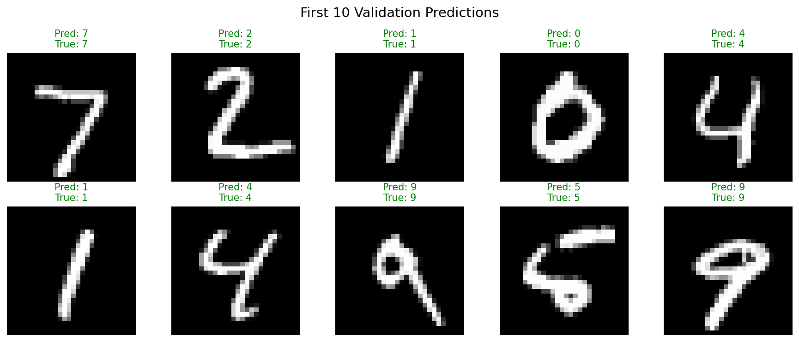
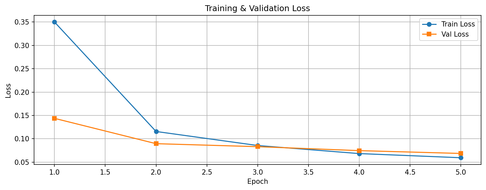
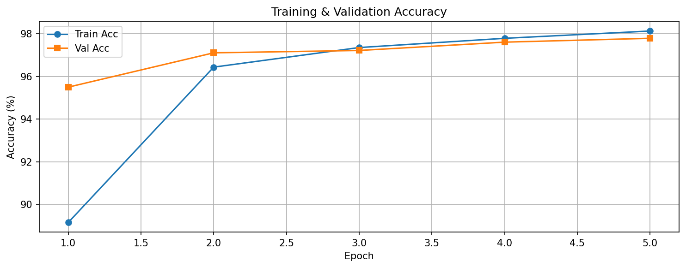

# Vision Transformer (ViT) from Scratch on MNIST


A minimal, educational, and fully functional **Vision Transformer (ViT)** implemented from scratch using PyTorch on the MNIST dataset.
It's designed for clarity and simplicity—no complex external libraries needed.

---

## 🚀 Results (After 5 Epochs)

The model generalizes extremely well, with training and validation performance being nearly identical.

> **Training Accuracy:** 97.79%  
> **Validation Accuracy:** 97.79%  
> **Validation Loss:** 0.0687

### 🤖 Sample Predictions


### 📈 Training Curves
| Loss Curve | Accuracy Curve |
| :---: | :---: |
|  |  |

---

## ✨ Features

| Feature | Description |
|---|---|
| **Pure ViT Architecture** | Implements the core ViT paper: Patch embedding → CLS token → Transformer blocks → MLP head. |
| **5-File Modular Design** | Cleanly separated code: `config.py`, `data.py`, `model.py`, `train.py`, `evaluation.py`. |
| **Full Evaluation Suite** | Generates accuracy, loss, and a plot of predictions, all **saved to the `results/` folder**. |
| **Training History** | Saves loss/accuracy curves to `history.json` for analysis. |
| **Checkpointing** | Automatically saves the `best` and `last` model weights to the `checkpoints/` folder. |
| **Windows & Multiprocessing Safe** | Includes `if __name__ == '__main__':` guards for robust execution. |
| **Attention-Ready** | The model includes a `forward_with_attention()` method, ready for you to extend and visualize. |

---

##  Quick Start

### Project Structure
```bash
ViT/
├── config.py              # Hyperparameters & all global settings
├── data.py                # Creates the MNIST DataLoaders
├── model.py               # The ViT model (PatchEmbedding, Transformer, etc.)
├── train.py               # Main training script
├── evaluation.py          # Main evaluation script (loads best model)
│
├── checkpoints/           # Auto-created for model weights
│   ├── vit_mnist_best.pth
│   ├── vit_mnist_last.pth
│   └── history.json
│
├── results/               # Auto-created for plots
│   ├── predictions.png
│   ├── loss_curve.png
│   └── accuracy_curve.png
│
└── README.md
```

###  Clone & Install
```bash
git clone [https://github.com/your-username/vit-mnist-from-scratch.git](https://github.com/your-username/vit-mnist-from-scratch.git)
cd vit-mnist-from-scratch

# Install dependencies
pip install torch torchvision matplotlib
```
### Output
```bash
Loading best model from checkpoints/vit_mnist_best.pth...
Validation Loss: 0.0687, Validation Accuracy: 97.79%
Plots saved to results/ folder.
```
### Architecture
This implementation is a mini-ViT adapted from the original paper, "An image is Worth 16x16 Words."

| Component | Value | Description |
|---|---|---|
| **Image Size** | 28×28 (grayscale) | Standard MNIST size. |
| **Patch Size** | 7×7 | Splits the 28x28 image into a **4x4 (16-patch) grid**. |
| **Embedding Dim** | 64 | Each of the 16 patches is projected into a 64-dim vector. |
| **Attention Heads** | 4 | The 64-dim vector is split among 4 heads (16 dims/head). |
| **Transformer Blocks**| 4 | Number of stacked Transformer Encoders. |
| **MLP Hidden** | 128 | Hidden size of the feed-forward network inside each block. |
| **Positional Encoding**| Learnable | A learnable vector is added to each patch embedding. |
| **CLS Token** | Learnable | A special token prepended to the patch sequence for classification. |

### Reference

This implementation is inspired by the original Vision Transformer paper:

[An Image is Worth 16x16 Words: Transformers for Image Recognition at Scale](https://arxiv.org/abs/2010.11929)
*Alexey Dosovitskiy, Lucas Beyer, Alexander Kolesnikov, et al.*
*ICLR 2021*


